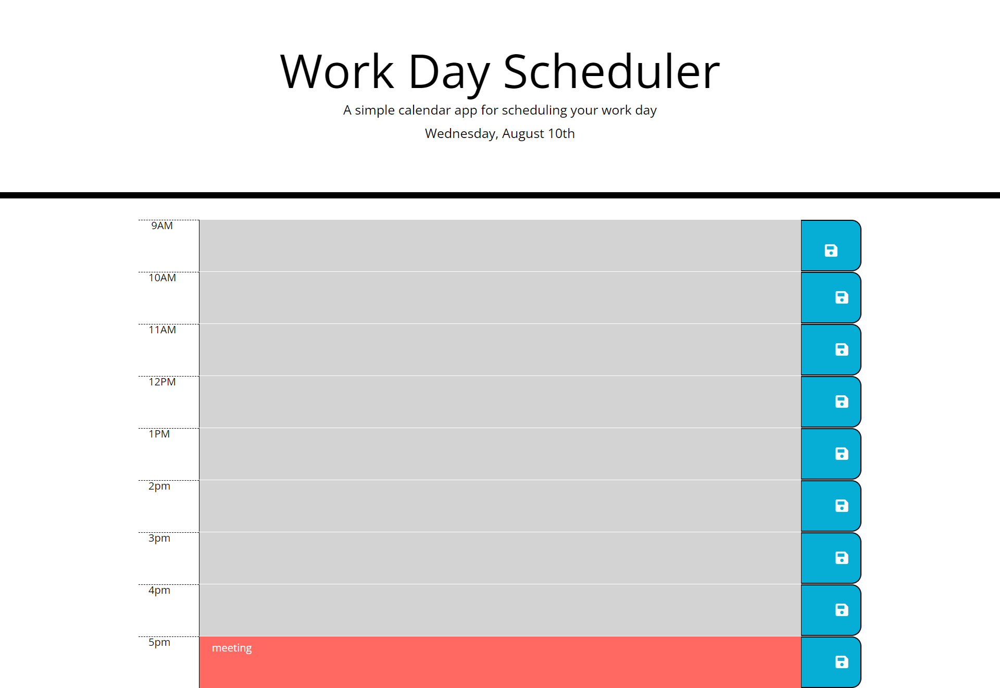

# day-planner

## Table of Contents

- [Description](#description)
- [Deployed Url](#deployed-url)
- [Technologies](#technologies)
- [Screenshots](#screenshots)

## Description

A calendar application that allows a user to save events for each hour of the day.

## Deployed URL

- Deployed link [here](https://mkn01.github.io/day-planner//)
- GitHub Repository [here](https://github.com/Mkn01/day-planner/tree/dev)

## Technologies

- HTML
- CSS
- GitHub Pages
- Javascript
- Google chrome

## Screenshots

### Desktop Viewports

